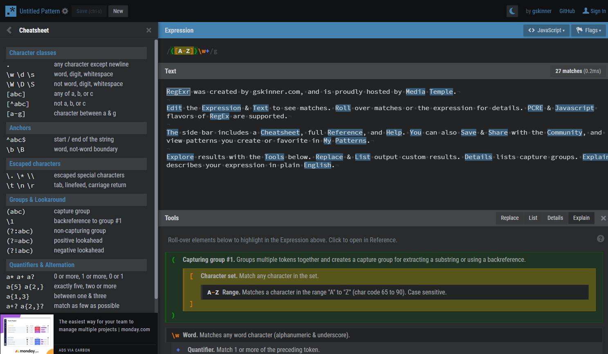
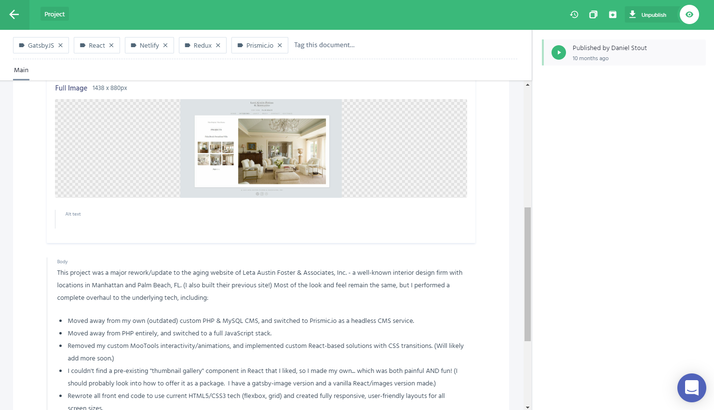
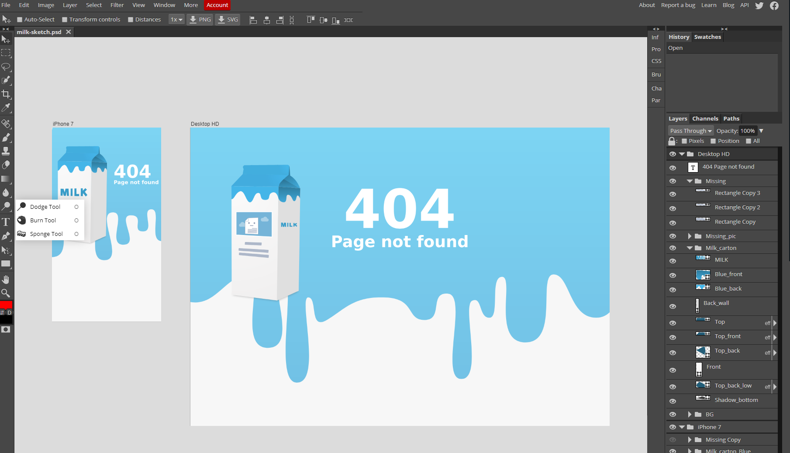
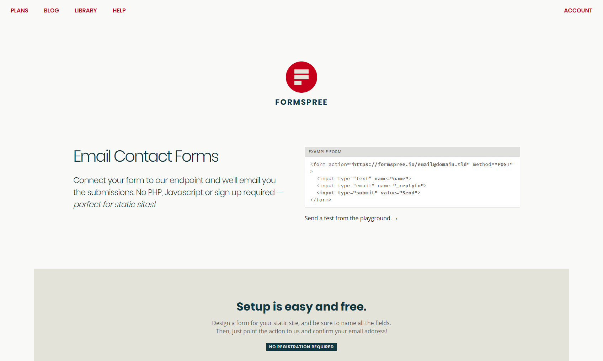

Over the past weekend I mentioned [RegExr](https://regexr.com/) in a popular developer's Twitter comments, and I was shocked at how many people had not heard of it. 

Due to that, I'm writing a quick post to list a few developer tools that I use. But...I'm listing items that don't get tons of hype, and probably should!

## [RegExr](https://regexr.com/)

Do RegExp (Regular Expressions) confuse the hell out of you? They definitely used to scramble my brain... 🧠🔨 

That all changed when I accidentally stumbled upon [RegExr](https://regexr.com/) a while ago! This site will let you paste in any RegExp, and it will test it AND explain the entire thing to you. You can even hover over parts of the expression, and it will highlight the corresponding part of the explanation. There's also a cheatsheet, a reference guide, and you can save/share your expressions with others via shortened URLs.

**Tip:** You can use these saved/shared links as code comments above each RegExp in your project. This will help you or anyone else to quickly understand the RegExp later on!

FYI: The creator of this, Grant Skinner (@gskinner), has been a hero of mine since my ActionScript days... and this is a perfect example of why. 💜

## Prismic.io

It seems like the JAMstack world is exploding, and I love it! But for some reason, one of the best headless CMS options available seems to be frequently ignored by most of the "popular" devolopers. I'm not one of those, so let me show you a secret... 

[Prismic.io](https://prismic.io/) is an incredible headless CMS that offers many of the same features that **FAR** more expensive services provide: unlimited custom types, GraphQL API (or REST), instant live previews before publishing, drag and drop/WYSIWYG, image cropping/resizing, and more. 

Sure, Contentful (_et al._) is nice...  but it's also _incredibly_ expensive! If you and your clients would rather save a ton of money: Try Prismic.io! 💯

## [Photopea](https://www.photopea.com)

Sometimes you may need a PS-like image editing program, and you don't have access to your software. (e.g. Maybe you're at your client's office, your laptop is at home... and you need to crop/resize some images, or edit a PSD.) [Photopea.com](https://www.photopea.com) is a great solution! 

It even handles Sketch files, which is what you see in the screenshot!

## [Formspree](https://formspree.io/)

Looking for a super easy way to handle contact forms on a static site? Give [Formspree](https://formspree.io/) a try! 

Their pricing is extremely reasonable, and they even have a free tier to test it out. 💌 

## Conclusion

That's all for this post! This wasn't an ad or anything; these are just products/tools that I admire and feel are deserving of more visibility! Hopefully this was helpful for someone, and/or you found a new tool to try out.

Until next time! 😎

