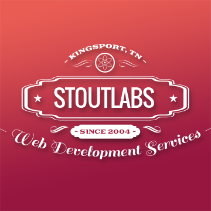

This is just a quick blog post to announce the launch of my new website!

I have been _deep_ in the depths of self-learning a TON of JavaScript, and this is the first live example of it. So...I'm pretty stoked to **_officially_** begin a new chapter in my career!

---

### Quick notes about the site:

- This website was built with [GatsbyJS (v2)](http://www.gatsbyjs.org), uses [Prismic.io](http://www.prismic.io) as a headless CMS, and is hosted on [Netlify](http://www.netlify.com). I absolutely LOVE this combo, and will definitely be using it more and more!
- I didn't really spend a _ton_ of time on the design, because I've been busy working on a separate GatsbyJS site for the past few weeks. I plan to come back soon and "polish" things up a bit more, though. (But first I want to tinker with React-based animations a bit more. I have plans...)
- For the same reasons, the code may be a bit "messy" in places... I'll clean it up when I re-visit the design stuff.
