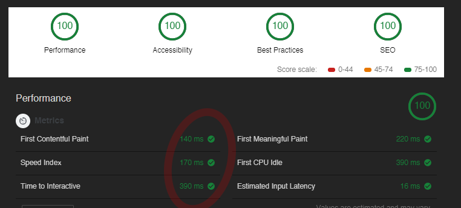

As a business owner, having a fast website is a lot more important than you might realize. Whether browsing on a mobile device or desktop computer, the simple fact remains: nobody likes waiting around for pages to load.

Like it or not, this is a "now" generation – and according to a recent Google report, around 20% of online visitors are likely to **_abandon_** a website if a single page load takes just three seconds! And even worse, that rate rapidly increases with every additional 0.1 seconds of time. There's so much more I could mention here, but I really want to keep this short and instructive.

### Let's Check Your Website Speed!

To run a free website performance audit, you'll just need to be using the current version of [Google's Chrome browser](https://www.google.com/chrome/). We'll be using a built-in tool in Chrome called [Lighthouse](https://developers.google.com/web/tools/lighthouse/), which is an automated tool that tests website performance in several key areas.

To access it, just load up your website in Chrome and then launch the "Chrome Developer Tools". (In Windows, it's `ctrl+shift+I`) In the developer tools window, you should see a handful of tabs at the top: Elements, Console, Network, etc. Look for the one labeled `Audits`, and click on it.

From there, you can select whether you want to run a mobile or desktop test, what types of audits to run, and whether you want to "throttle" the connection. (This simulates a mobile 3G connection and/or a weaker mobile CPU, to mimic how your site performs on slower mobile connections/processors.)

Finally, just click the "run audits" button and wait for it to finish. You can view the results in the dev tools window afterwards, and you can even download a fully detailed report via the "download report" button in the top left area of the dev tools window. (Just under the tabs.)

Note: If you are running any extensions in your Chrome browser, they can have a negative effect on these tests/results. You will want to do these tests from an "incognito" Chrome browser instead – as it won't load any of your extensions. (Feel free to reach out if you need help with this!)

### My Website Speed Results

Here's a look at my website's Lighthouse desktop audit results. Notice how _insanely_ fast it loads and is ready for interaction: 0.14 seconds and 0.39 seconds, respectively! I actually scored a 92 on the mobile 'performance' section, but that slight hit is due to a font I'm importing from Google Fonts. (That will be fixed this week, and afterwards I'll post the final results and explain how I fixed it.)

Chances are high that my results look **MUCH** better than yours... but don't panic! If you would like similar results for your site, I would absolutely love to help you. [Get in touch with me](https://www.stoutlabs.com/#contact) and we'll set up a discussion about your site's current results, and the steps we can take to improve them.
